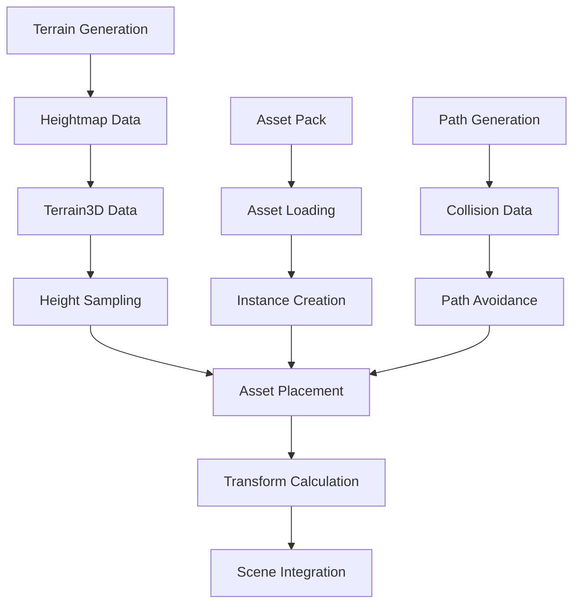

# Terrain3D Asset Placement: Theory and Architecture
**Date:** 2025-09-14  
**Topic:** Theoretical Foundation of Terrain3D Asset Placement  
**Difficulty:** Intermediate to Advanced  

## 🎯 Overview

This document explores the theoretical foundations of asset placement in Terrain3D, covering the underlying systems, data structures, and architectural principles that make terrain-based asset placement work.

## 🏗️ Terrain3D Architecture

### 1. **Core Components**

Terrain3D consists of several interconnected systems:

```
Terrain3D System Architecture:
├── Terrain3D (Main Node)
│   ├── Data Management
│   │   ├── Heightmap Data
│   │   ├── Texture Data
│   │   └── Collision Data
│   ├── Rendering System
│   │   ├── Mesh Generation
│   │   ├── LOD Management
│   │   └── Material Application
│   └── Instancer System
│       ├── Asset Management
│       ├── Transform Arrays
│       └── Batch Rendering
├── Terrain3DManager
│   ├── Scene Integration
│   ├── Data Loading
│   └── System Initialization
└── Terrain3DStorage
    ├── File I/O
    ├── Data Compression
    └── Cache Management
```

### 2. **Data Flow Architecture**



## 📊 Data Structures and Storage

### 1. **Heightmap Data Structure**

Terrain3D stores height data in a structured format:

```gdscript
# Conceptual heightmap data structure
class TerrainHeightData:
    var width: int
    var height: int
    var scale: float
    var heights: Array[float]  # 1D array for performance
    
    func get_height(x: float, z: float) -> float:
        # Convert world coordinates to heightmap indices
        var local_x = x / scale
        var local_z = z / scale
        
        # Clamp to valid range
        local_x = clamp(local_x, 0, width - 1)
        local_z = clamp(local_z, 0, height - 1)
        
        # Bilinear interpolation for smooth heights
        return bilinear_interpolate(local_x, local_z)
```

### 2. **Asset Data Structure**

```gdscript
# Asset pack data structure
class Terrain3DAsset:
    var mesh: Mesh
    var material: Material
    var collision_shape: Shape3D
    var scale_range: Vector2
    var rotation_range: Vector2
    var density: float
    
class Terrain3DAssetPack:
    var trees: Array[Terrain3DAsset]
    var vegetation: Array[Terrain3DAsset]
    var rocks: Array[Terrain3DAsset]
    var debris: Array[Terrain3DAsset]
```

### 3. **Transform Data Structure**

```gdscript
# Transform data for instancer system
class Terrain3DTransform:
    var position: Vector3
    var rotation: Vector3
    var scale: Vector3
    
    func to_transform3d() -> Transform3D:
        return Transform3D(
            Basis.from_euler(rotation) * Basis.from_scale(scale),
            position
        )
```

## 🔄 Asset Placement Algorithms

### 1. **Random Placement Algorithm**

```gdscript
func random_placement_algorithm(center: Vector3, radius: float, asset_count: int) -> Array[Terrain3DTransform]:
    """Basic random placement algorithm"""
    var transforms: Array[Terrain3DTransform] = []
    
    for i in range(asset_count):
        # Generate random position within radius
        var angle = randf() * TAU
        var distance = randf() * radius
        var pos = center + Vector3(
            cos(angle) * distance,
            0,  # Y will be set by terrain height
            sin(angle) * distance
        )
        
        # Get terrain height
        var terrain_height = get_terrain_height(pos)
        pos.y = terrain_height
        
        # Generate random rotation and scale
        var rotation = Vector3(0, randf() * TAU, 0)
        var scale = Vector3(
            randf_range(0.8, 1.2),
            randf_range(0.8, 1.2),
            randf_range(0.8, 1.2)
        )
        
        transforms.append(Terrain3DTransform.new(pos, rotation, scale))
    
    return transforms
```

### 2. **Poisson Disk Sampling Algorithm**

```gdscript
func poisson_disk_sampling(center: Vector3, radius: float, min_distance: float) -> Array[Terrain3DTransform]:
    """Poisson disk sampling for natural distribution"""
    var transforms: Array[Terrain3DTransform] = []
    var active_list: Array[Vector3] = []
    var grid: Dictionary = {}
    var cell_size = min_distance / sqrt(2.0)
    
    # Initialize with random point
    var initial_pos = center + Vector3(
        randf_range(-radius, radius),
        0,
        randf_range(-radius, radius)
    )
    active_list.append(initial_pos)
    transforms.append(create_transform_at_position(initial_pos))
    
    while active_list.size() > 0:
        var random_index = randi() % active_list.size()
        var point = active_list[random_index]
        var found = false
        
        # Try to place new point
        for i in range(30):  # Maximum attempts
            var new_point = generate_point_around(point, min_distance)
            
            if is_point_valid(new_point, center, radius, min_distance, grid, cell_size):
                active_list.append(new_point)
                transforms.append(create_transform_at_position(new_point))
                found = true
                break
        
        if not found:
            active_list.remove_at(random_index)
    
    return transforms

func generate_point_around(point: Vector3, min_distance: float) -> Vector3:
    """Generate a random point around the given point"""
    var angle = randf() * TAU
    var distance = randf_range(min_distance, min_distance * 2)
    return point + Vector3(
        cos(angle) * distance,
        0,
        sin(angle) * distance
    )
```

### 3. **Biome-Based Placement Algorithm**

```gdscript
func biome_based_placement(center: Vector3, radius: float) -> Array[Terrain3DTransform]:
    """Place assets based on terrain biome characteristics"""
    var transforms: Array[Terrain3DTransform] = []
    
    for i in range(100):  # Sample points
        var angle = randf() * TAU
        var distance = randf() * radius
        var pos = center + Vector3(
            cos(angle) * distance,
            0,
            sin(angle) * distance
        )
        
        # Analyze terrain characteristics
        var terrain_height = get_terrain_height(pos)
        var slope = get_terrain_slope(pos)
        var moisture = get_terrain_moisture(pos)
        
        # Determine biome type
        var biome = determine_biome(terrain_height, slope, moisture)
        
        # Select appropriate assets for biome
        var assets = get_assets_for_biome(biome)
        if assets.size() > 0:
            var asset = assets[randi() % assets.size()]
            var transform = create_transform_for_biome(pos, asset, biome)
            transforms.append(transform)
    
    return transforms

func determine_biome(height: float, slope: float, moisture: float) -> String:
    """Determine biome type based on terrain characteristics"""
    if height > 100 and slope > 0.5:
        return "mountain"
    elif height > 50 and slope > 0.3:
        return "highland"
    elif moisture > 0.7:
        return "wetland"
    elif moisture > 0.4:
        return "forest"
    else:
        return "plains"
```

## 🎨 Rendering and Performance

### 1. **LOD (Level of Detail) System**

```gdscript
class Terrain3DLOD:
    var distance_thresholds: Array[float] = [50.0, 100.0, 200.0]
    var lod_levels: Array[int] = [0, 1, 2, 3]
    
    func get_lod_level(camera_pos: Vector3, asset_pos: Vector3) -> int:
        """Determine LOD level based on distance to camera"""
        var distance = camera_pos.distance_to(asset_pos)
        
        for i in range(distance_thresholds.size()):
            if distance < distance_thresholds[i]:
                return lod_levels[i]
        
        return lod_levels[-1]  # Lowest LOD
    
    func apply_lod(asset: Node3D, lod_level: int):
        """Apply LOD to asset"""
        match lod_level:
            0:  # High detail
                asset.visible = true
                asset.scale = Vector3.ONE
            1:  # Medium detail
                asset.visible = true
                asset.scale = Vector3(0.8, 0.8, 0.8)
            2:  # Low detail
                asset.visible = true
                asset.scale = Vector3(0.6, 0.6, 0.6)
            3:  # Culled
                asset.visible = false
```

### 2. **Instancer System Architecture**

```gdscript
class Terrain3DInstancer:
    var asset_meshes: Array[Mesh]
    var transform_arrays: Array[Array]
    var material_instances: Array[Material]
    
    func add_transforms(asset_index: int, transforms: Array[Transform3D]):
        """Add transforms for batch rendering"""
        if asset_index >= transform_arrays.size():
            transform_arrays.resize(asset_index + 1)
            transform_arrays[asset_index] = []
        
        transform_arrays[asset_index].append_array(transforms)
    
    func render_instances():
        """Render all instances using GPU instancing"""
        for i in range(asset_meshes.size()):
            if transform_arrays[i].size() > 0:
                RenderingServer.multimesh_set_mesh(
                    multimesh_rid,
                    asset_meshes[i].get_rid()
                )
                RenderingServer.multimesh_set_instance_count(
                    multimesh_rid,
                    transform_arrays[i].size()
                )
                
                # Set transforms
                for j in range(transform_arrays[i].size()):
                    RenderingServer.multimesh_set_instance_transform(
                        multimesh_rid,
                        j,
                        transform_arrays[i][j]
                    )
```

## 🔧 Integration Patterns

### 1. **Scene Integration Pattern**

```gdscript
class Terrain3DSceneIntegration:
    var terrain3d: Terrain3D
    var asset_placer: Node3D
    var path_system: PathSystem
    var player: Node3D
    
    func setup_integration():
        """Setup integration between systems"""
        # Connect to terrain3d signals
        terrain3d.terrain_updated.connect(_on_terrain_updated)
        
        # Setup asset placer
        asset_placer = Node3D.new()
        asset_placer.name = "AssetPlacer"
        add_child(asset_placer)
        
        # Connect to player movement
        player.player_moved.connect(_on_player_moved)
    
    func _on_terrain_updated():
        """Handle terrain updates"""
        # Regenerate assets when terrain changes
        regenerate_assets_near_player()
    
    func _on_player_moved(new_position: Vector3):
        """Handle player movement"""
        # Update LOD and culling based on player position
        update_asset_lod(new_position)
```

### 2. **Event-Driven Architecture**

```gdscript
class Terrain3DEventSystem:
    signal asset_placed(asset: Node3D, position: Vector3)
    signal asset_removed(asset: Node3D)
    signal terrain_height_changed(position: Vector3, old_height: float, new_height: float)
    signal path_generated(path_data: Dictionary)
    
    func place_asset(asset: Node3D, position: Vector3):
        """Place asset and emit event"""
        asset.global_position = position
        asset_placer.add_child(asset)
        asset_placed.emit(asset, position)
    
    func remove_asset(asset: Node3D):
        """Remove asset and emit event"""
        asset.queue_free()
        asset_removed.emit(asset)
```

## 📈 Performance Optimization Strategies

### 1. **Spatial Partitioning**

```gdscript
class Terrain3DSpatialGrid:
    var cell_size: float = 100.0
    var grid: Dictionary = {}
    
    func get_cell_key(position: Vector3) -> Vector2i:
        """Get grid cell key for position"""
        return Vector2i(
            int(position.x / cell_size),
            int(position.z / cell_size)
        )
    
    func add_asset(asset: Node3D, position: Vector3):
        """Add asset to spatial grid"""
        var key = get_cell_key(position)
        if not grid.has(key):
            grid[key] = []
        grid[key].append(asset)
    
    func get_assets_in_radius(center: Vector3, radius: float) -> Array[Node3D]:
        """Get all assets within radius"""
        var assets: Array[Node3D] = []
        var cell_radius = int(radius / cell_size) + 1
        
        for x in range(-cell_radius, cell_radius + 1):
            for z in range(-cell_radius, cell_radius + 1):
                var key = Vector2i(
                    int(center.x / cell_size) + x,
                    int(center.z / cell_size) + z
                )
                if grid.has(key):
                    assets.append_array(grid[key])
        
        return assets
```

### 2. **Async Asset Loading**

```gdscript
class Terrain3DAsyncLoader:
    var loading_queue: Array[String] = []
    var loaded_assets: Dictionary = {}
    var loading_thread: Thread
    
    func load_asset_async(asset_path: String):
        """Load asset asynchronously"""
        if loaded_assets.has(asset_path):
            return loaded_assets[asset_path]
        
        loading_queue.append(asset_path)
        if not loading_thread.is_started():
            loading_thread.start(_loading_worker)
    
    func _loading_worker():
        """Worker thread for asset loading"""
        while loading_queue.size() > 0:
            var asset_path = loading_queue.pop_front()
            var asset = load(asset_path)
            loaded_assets[asset_path] = asset
```

## 🎯 Design Patterns

### 1. **Strategy Pattern for Placement Algorithms**

```gdscript
class PlacementStrategy:
    func place_assets(center: Vector3, radius: float, asset_count: int) -> Array[Terrain3DTransform]:
        pass

class RandomPlacementStrategy extends PlacementStrategy:
    func place_assets(center: Vector3, radius: float, asset_count: int) -> Array[Terrain3DTransform]:
        return random_placement_algorithm(center, radius, asset_count)

class PoissonPlacementStrategy extends PlacementStrategy:
    func place_assets(center: Vector3, radius: float, asset_count: int) -> Array[Terrain3DTransform]:
        return poisson_disk_sampling(center, radius, 5.0)

class BiomePlacementStrategy extends PlacementStrategy:
    func place_assets(center: Vector3, radius: float, asset_count: int) -> Array[Terrain3DTransform]:
        return biome_based_placement(center, radius)
```

### 2. **Observer Pattern for System Integration**

```gdscript
class Terrain3DObserver:
    func on_terrain_updated(terrain: Terrain3D):
        pass
    
    func on_asset_placed(asset: Node3D, position: Vector3):
        pass

class Terrain3DSubject:
    var observers: Array[Terrain3DObserver] = []
    
    func add_observer(observer: Terrain3DObserver):
        observers.append(observer)
    
    func notify_terrain_updated(terrain: Terrain3D):
        for observer in observers:
            observer.on_terrain_updated(terrain)
    
    func notify_asset_placed(asset: Node3D, position: Vector3):
        for observer in observers:
            observer.on_asset_placed(asset, position)
```

## 📝 Conclusion

Understanding the theoretical foundations of Terrain3D asset placement is crucial for:

1. **Implementing** robust and efficient asset placement systems
2. **Optimizing** performance through proper data structures and algorithms
3. **Integrating** with other game systems effectively
4. **Debugging** issues when they arise
5. **Extending** the system with new features

The key principles are:
- **Data-driven design** with proper data structures
- **Algorithmic diversity** for different placement needs
- **Performance optimization** through spatial partitioning and LOD
- **System integration** through event-driven architecture
- **Design patterns** for maintainable and extensible code

---
**Next Document:** [Terrain3D Asset Placement Practical Guide](./2025-09-14_Terrain3D_Asset_Placement_Practical_Guide.md)  
**Previous Document:** [Terrain3D Coordinate Systems Deep Dive](./2025-09-14_Terrain3D_Coordinate_Systems_Deep_Dive.md)  
**Documentation Status:** ✅ Complete  
**Last Updated:** 2025-09-14
