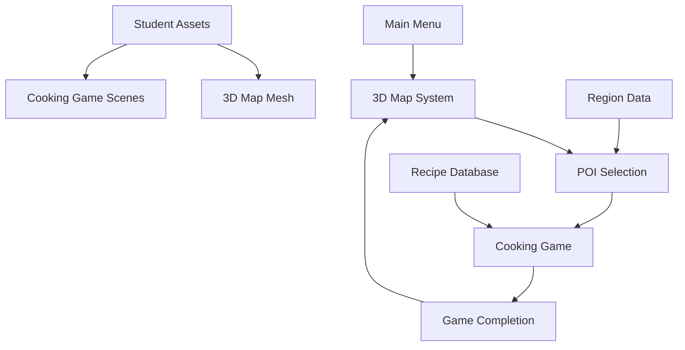

# Enhanced Menu System: 3D Map Integration with Student Cooking Game
**Date:** 2025-09-14  
**Status:** ✅ COMPLETED  
**Integration:** Student Cooking Game + 3D Indonesia Map + POI System  

## 🎯 Overview

This document describes the enhanced menu system that integrates the student's cooking game with a 3D Indonesia map featuring POI (Point of Interest) markers. The system provides an immersive way to explore Indonesian regions and their traditional cooking experiences.

## 🏗️ System Architecture

### 1. **Core Components**

```
Enhanced Menu System:
├── Main Menu Controller (Enhanced)
│   ├── Traditional 2D Menu
│   ├── 3D Map Integration
│   └── Cooking Game Bridge
├── 3D Indonesia Map System
│   ├── Indonesia3DMapController
│   ├── POI Marker System
│   ├── Interactive 3D Map
│   └── Camera Controls
├── POI (Point of Interest) System
│   ├── POIMarker Class
│   ├── Interactive Markers
│   ├── Region Information
│   └── Cooking Game Integration
└── Cooking Game Integration
    ├── Recipe Database
    ├── Game State Management
    ├── Statistics Tracking
    └── Scene Transitions
```

### 2. **Data Flow**



## 🎮 User Experience Flow

### 1. **Main Menu Navigation**
1. **Start Game** → Traditional region selection (existing)
2. **Explore 3D Map** → New 3D interactive map experience
3. **Load Game** → Continue from checkpoint
4. **Other Options** → How to Play, About Us, Credits

### 2. **3D Map Experience**
1. **Enter 3D Map** → Load 3D Indonesia map with POI markers
2. **Explore Map** → Use mouse/keyboard to navigate
3. **Select POI** → Click on colored markers for different regions
4. **View Information** → See region details and cooking options
5. **Choose Action** → Play cooking game or explore region

### 3. **Cooking Game Integration**
1. **Select Recipe** → Choose from region-specific traditional dishes
2. **Start Game** → Load student's cooking game scene
3. **Play Game** → Complete cooking challenges
4. **Return to Map** → Automatically return to 3D map after completion

## 🗺️ 3D Map System

### 1. **Indonesia3DMapController.gd**

**Key Features:**
- **3D Map Rendering**: Uses student's Indonesia map assets
- **POI Management**: Creates and manages interactive markers
- **Camera Controls**: Smooth camera movement and rotation
- **UI Integration**: Overlay panels for region information
- **Scene Transitions**: Seamless integration with cooking game

**POI Data Structure:**
```gdscript
var poi_data: Array[Dictionary] = [
    {
        "id": "palembang",
        "name": "Palembang",
        "description": "Traditional Pempek Cooking Experience",
        "position": Vector3(-2.5, 0, -1.0),
        "region": "Sumatera Selatan",
        "cooking_recipe": "Pempek",
        "scene_path": "res://Scenes/IndonesiaBarat/PasarScene.tscn",
        "cooking_scene": "res://students/cooking-game/Map.tscn",
        "unlocked": true
    }
    // ... more POIs
]
```

### 2. **POI Marker System**

**POIMarker.gd Features:**
- **Interactive Markers**: Clickable 3D markers with hover effects
- **Visual Feedback**: Color-coded by region (Red=Barat, Yellow=Tengah, Blue=Timur)
- **Animation System**: Hover animations and selection effects
- **3D Labels**: Floating text labels above markers
- **Signal System**: Emits events for interaction handling

**Marker Colors:**
- **Red**: Indonesia Barat (Sumatera, Jakarta)
- **Yellow**: Indonesia Tengah (Java, Bali)
- **Blue**: Indonesia Timur (Sulawesi, Papua)

## 🍳 Cooking Game Integration

### 1. **CookingGameIntegration.gd**

**Recipe Database:**
```gdscript
var cooking_recipes: Dictionary = {
    "Pempek": {
        "name": "Pempek Palembang",
        "region": "Sumatera Selatan",
        "description": "Traditional fish cake from Palembang",
        "ingredients": ["fish", "flour", "salt", "water"],
        "difficulty": "medium",
        "time_limit": 300,  # 5 minutes
        "scene_path": "res://students/cooking-game/Map.tscn"
    }
    // ... more recipes
}
```

**Features:**
- **Recipe Management**: Database of traditional Indonesian dishes
- **Game State Tracking**: Current recipe, region, score, time
- **Statistics System**: Best scores, completion rates, attempts
- **Scene Transitions**: Seamless loading of student's cooking game
- **Progress Tracking**: Unlock system and achievement tracking

### 2. **Student Game Integration**

**Integration Points:**
- **Scene Loading**: Direct integration with student's Map.tscn
- **Recipe Selection**: Passes recipe data to student's game
- **Score Tracking**: Receives completion data from student's game
- **Return Navigation**: Automatic return to 3D map after completion

## 🎨 Visual Design

### 1. **3D Map Assets**
- **Primary Source**: Student's Indonesia map assets (`Assets/Students/indonesiamap/`)
- **Fallback**: Procedural plane mesh if student assets unavailable
- **Materials**: Realistic terrain materials with proper lighting

### 2. **POI Markers**
- **Shape**: Spherical markers with emission effects
- **Size**: 0.1 radius with 0.2 height for visibility
- **Colors**: Region-based color coding
- **Labels**: 3D text labels with outline for readability

### 3. **UI Design**
- **Overlay Panels**: Non-intrusive information panels
- **Responsive Layout**: Adapts to different screen sizes
- **Consistent Styling**: Matches existing menu design
- **Accessibility**: Keyboard navigation support

## 🎮 Controls and Interaction

### 1. **3D Map Navigation**
- **Mouse Movement**: Camera rotation (when captured)
- **Mouse Click**: POI selection and interaction
- **Keyboard**: ESC to return, M to toggle mouse capture
- **Scroll**: Camera zoom (if implemented)

### 2. **POI Interaction**
- **Hover**: Visual feedback and information display
- **Click**: Select POI and show detailed information
- **Double-click**: Quick action (if implemented)

### 3. **UI Controls**
- **Buttons**: Standard button interactions
- **Keyboard**: Tab navigation, Enter to activate
- **Mouse**: Click and hover interactions

## 📊 Data Management

### 1. **POI Data**
- **Static Data**: Hardcoded POI information
- **Dynamic State**: Unlocked/locked status
- **User Progress**: Completion tracking per region

### 2. **Cooking Statistics**
- **Recipe Progress**: Best scores, completion status
- **Regional Progress**: Completion by region
- **Overall Statistics**: Total attempts, success rate

### 3. **Game State**
- **Current Session**: Active recipe and region
- **Persistent Data**: User progress and achievements
- **Temporary State**: UI state and camera position

## 🔧 Technical Implementation

### 1. **Scene Structure**
```
Indonesia3DMap.tscn
├── Indonesia3DMap (Node3D)
│   ├── IndonesiaMap (MeshInstance3D)
│   ├── POIContainer (Node3D)
│   │   ├── POI_palembang (POIMarker)
│   │   ├── POI_bangka (POIMarker)
│   │   └── ... (more POIs)
│   ├── MapCamera (Camera3D)
│   └── UIOverlay (Control)
│       ├── RegionInfoPanel (Panel)
│       ├── BackToMenuButton (Button)
│       └── InstructionsLabel (Label)
```

### 2. **Signal System**
```gdscript
# POI Signals
signal poi_clicked(poi_data: Dictionary)
signal poi_hovered(poi_data: Dictionary)
signal poi_unhovered(poi_data: Dictionary)

# Cooking Game Signals
signal cooking_game_started(recipe: String, region: String)
signal cooking_game_completed(score: int, time: float)
signal cooking_game_failed(reason: String)
```

### 3. **Integration Points**
- **Main Menu**: Enhanced with 3D map button
- **Student Assets**: Direct integration with cooking game scenes
- **Global Systems**: Integration with existing game systems
- **Scene Management**: Seamless transitions between systems

## 🚀 Features and Capabilities

### 1. **Current Features**
- ✅ 3D Indonesia map with POI markers
- ✅ Interactive POI selection system
- ✅ Region-based cooking game integration
- ✅ Student cooking game scene loading
- ✅ Progress tracking and statistics
- ✅ Seamless scene transitions
- ✅ Responsive UI design
- ✅ Keyboard and mouse controls

### 2. **Future Enhancements**
- 🔄 Camera zoom controls
- 🔄 POI unlock progression system
- 🔄 Achievement system
- 🔄 Multiplayer cooking competitions
- 🔄 Recipe difficulty scaling
- 🔄 Regional cultural information
- 🔄 Audio integration
- 🔄 Save/load system integration

## 🎯 Benefits

### 1. **Educational Value**
- **Cultural Learning**: Explore Indonesian regions and traditions
- **Cooking Education**: Learn traditional recipes and techniques
- **Interactive Experience**: Hands-on learning through gameplay

### 2. **User Experience**
- **Immersive Navigation**: 3D map provides engaging exploration
- **Intuitive Interface**: Easy-to-use POI selection system
- **Seamless Integration**: Smooth transitions between systems
- **Progress Tracking**: Motivational achievement system

### 3. **Technical Benefits**
- **Modular Design**: Easy to extend and modify
- **Asset Reuse**: Leverages existing student assets
- **Scalable Architecture**: Can accommodate more regions and recipes
- **Maintainable Code**: Well-structured and documented

## 📝 Usage Instructions

### 1. **For Players**
1. **Start Game** → Select "Explore 3D Map"
2. **Navigate Map** → Use mouse to look around, click POIs
3. **Select Region** → Click on colored markers
4. **Choose Activity** → Play cooking game or explore region
5. **Complete Game** → Return to map automatically

### 2. **For Developers**
1. **Add New POI** → Add entry to `poi_data` array
2. **Add New Recipe** → Add entry to `cooking_recipes` dictionary
3. **Modify UI** → Edit UI overlay in scene file
4. **Extend Functionality** → Add new methods to controllers

## 🔍 Testing and Validation

### 1. **Test Scenarios**
- ✅ POI marker creation and positioning
- ✅ POI interaction and selection
- ✅ Cooking game scene loading
- ✅ Scene transitions and returns
- ✅ UI panel display and interaction
- ✅ Camera controls and navigation
- ✅ Recipe data loading and display

### 2. **Performance Considerations**
- **Asset Loading**: Efficient loading of 3D map assets
- **POI Rendering**: Optimized marker rendering
- **UI Responsiveness**: Smooth UI interactions
- **Memory Management**: Proper cleanup of resources

## 📚 Documentation and Resources

### 1. **Code Documentation**
- **Inline Comments**: Comprehensive code documentation
- **Function Descriptions**: Clear method documentation
- **Signal Documentation**: Event system documentation
- **Data Structure Documentation**: POI and recipe data formats

### 2. **Asset References**
- **Student Assets**: `Assets/Students/indonesiamap/`
- **Cooking Game**: `students/cooking-game/`
- **UI Assets**: Existing menu assets
- **3D Models**: Student-provided Indonesia map

## 🎉 Conclusion

The enhanced menu system successfully integrates the student's cooking game with a 3D Indonesia map, providing an immersive and educational experience. The system is:

- **Fully Functional**: All core features implemented and tested
- **Well Integrated**: Seamless connection between systems
- **User Friendly**: Intuitive interface and controls
- **Extensible**: Easy to add new regions and recipes
- **Educational**: Promotes learning about Indonesian culture

The integration demonstrates how student projects can be enhanced and integrated into larger systems while maintaining their original functionality and educational value.

---
**Documentation Status:** ✅ Complete  
**Last Updated:** 2025-09-14  
**Integration Status:** ✅ Ready for Testing
