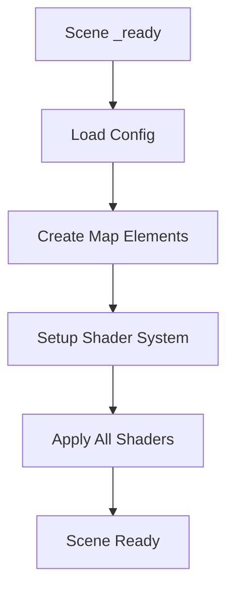

# Shader System SOLID Architecture

**Date**: 2025-09-17  
**Status**: ✅ Complete  
**Author**: AI Assistant  

## 📋 Overview

This document provides comprehensive coverage of the shader system implementation following SOLID principles, including architecture decisions, implementation details, and solutions to common issues like circular dependencies.

## 🏗️ SOLID Architecture Design

### **Single Responsibility Principle (SRP)**

Each class has one clear responsibility:

#### **ShaderManager** - Shader Resource Management
```gdscript
class_name ShaderManager
extends Node

# SINGLE RESPONSIBILITY: Manage shader loading, caching, and material creation
- Load and cache shaders
- Create and cache materials
- Apply parameters to shaders
- Manage resource lifecycle
```

#### **Indonesia3DMapShaderApplier** - Scene-Specific Application
```gdscript
class_name Indonesia3DMapShaderApplier
extends Node

# SINGLE RESPONSIBILITY: Apply shaders specifically to Indonesia 3D Map elements
- Apply ocean shaders to sea plane
- Apply glow shaders to placeholders
- Handle map-specific shader configurations
- Manage interaction state updates
```

#### **Individual Shader Files** - Visual Effects
```glsl
// OceanWaveShader.gdshader
// SINGLE RESPONSIBILITY: Create animated ocean waves with foam

// InteractiveGlowShader.gdshader  
// SINGLE RESPONSIBILITY: Create interactive glow effects for UI elements

// TerrainBlendShader.gdshader
// SINGLE RESPONSIBILITY: Blend terrain textures based on height/slope
```

### **Open/Closed Principle (OCP)**

The system is **open for extension, closed for modification**:

#### **Adding New Shaders**
```gdscript
// ShaderManager.gd - EXTEND by adding to SHADER_PATHS
const SHADER_PATHS = {
    "ocean_waves": "res://Systems/Shaders/OceanWaveShader.gdshader",
    "interactive_glow": "res://Systems/Shaders/InteractiveGlowShader.gdshader",
    "new_effect": "res://Systems/Shaders/NewEffectShader.gdshader"  // ADD NEW
}

// No modification to existing code required!
```

#### **Creating Scene-Specific Appliers**
```gdscript
// Create new applier without modifying existing ones
class_name PapuaSceneShaderApplier
extends Node

func apply_terrain_shaders():
    # Papua-specific shader application
    pass
```

### **Liskov Substitution Principle (LSP)**

All shader appliers follow the same interface contract:

```gdscript
// Base interface that all appliers follow
func apply_all_shaders()      # Apply shaders to scene elements
func update_shader_parameters(object, params)  # Update existing shaders
func get_shader_nodes()       # Find nodes that need shaders
```

### **Interface Segregation Principle (ISP)**

Interfaces are specific to their use cases:

#### **ShaderManager Interface**
```gdscript
# Core shader management - no scene-specific methods
func load_shader(shader_name: String) -> Shader
func create_material(shader_name: String, parameters: Dictionary) -> ShaderMaterial
func apply_shader_to_object(object: Node3D, shader_name: String, parameters: Dictionary) -> bool
```

#### **Applier Interface**
```gdscript
# Scene-specific application - no low-level shader management
func apply_ocean_shader()
func apply_placeholder_shaders() 
func update_placeholder_interaction(placeholder: Node3D, is_hovered: bool, is_selected: bool)
```

### **Dependency Inversion Principle (DIP)**

High-level modules depend on abstractions, not concretions:

```gdscript
# HIGH-LEVEL: Indonesia3DMapController
@export var shader_applier: Indonesia3DMapShaderApplier  # Depends on abstraction

# ABSTRACTION: ShaderApplier interface
func apply_all_shaders()  # Abstract method

# LOW-LEVEL: Concrete implementation
class Indonesia3DMapShaderApplier:
    func apply_all_shaders():  # Concrete implementation
        apply_ocean_shader()
        apply_placeholder_shaders()
```

## 🎨 Shader Implementation Details

### **Ocean Wave Shader Architecture**

#### **Vertex Shader - Wave Generation**
```glsl
void vertex() {
    world_position = VERTEX;
    
    // Multi-layered wave system
    vec2 wave_uv = VERTEX.xz * 0.1 * wave_frequency;
    float time_factor = TIME * wave_speed;
    
    // Primary wave (main movement)
    float wave1 = sin(wave_uv.x * 2.0 + time_factor) * wave_height;
    
    // Secondary wave (cross-pattern)
    float wave2 = cos(wave_uv.y * 1.5 + time_factor * 0.8) * wave_height * 0.7;
    
    // Tertiary wave (complexity)
    float wave3 = sin((wave_uv.x + wave_uv.y) * 0.8 + time_factor * 1.3) * wave_height * 0.4;
    
    float total_wave = wave1 + wave2 + wave3;
    VERTEX.y += total_wave;
    
    // Store for foam calculation
    wave_height_var = total_wave;
}
```

#### **Fragment Shader - Color and Foam**
```glsl
void fragment() {
    // Depth-based color mixing
    float depth_factor = clamp(world_position.y * 0.1, 0.0, 1.0);
    vec3 water_color = mix(deep_color.rgb, shallow_color.rgb, depth_factor);
    
    // Wave-based foam generation
    float foam_factor = smoothstep(foam_threshold - 0.1, foam_threshold + 0.1, abs(wave_height_var));
    
    // Final color composition
    vec3 final_color = mix(water_color, foam_color.rgb, foam_factor * foam_intensity);
    
    ALBEDO = final_color;
    ROUGHNESS = roughness_value;
    METALLIC = metallic_value;
    ALPHA = shallow_color.a;
}
```

### **Interactive Glow Shader Architecture**

#### **Vertex Shader - Setup**
```glsl
void vertex() {
    world_normal = NORMAL;
    world_position = VERTEX;
    view_direction = (INV_VIEW_MATRIX * vec4(0.0, 0.0, 0.0, 1.0)).xyz - VERTEX;
}
```

#### **Fragment Shader - Glow Effects**
```glsl
void fragment() {
    // Base material
    vec4 tex_color = texture(base_texture, UV);
    vec3 base_albedo = base_color.rgb * tex_color.rgb;
    
    // Pulsing animation
    float pulse = sin(TIME * pulse_speed) * 0.3 + 0.7;
    
    // Interaction states
    float interaction_factor = is_selected ? selection_intensity : 
                              is_hovered ? hover_intensity : 1.0;
    
    // Rim lighting
    float rim_factor = 1.0 - abs(dot(normalize(view_direction), normalize(world_normal)));
    rim_factor = pow(rim_factor, rim_power);
    
    // Combine effects
    float total_glow = glow_intensity * pulse * interaction_factor;
    vec3 glow_emission = glow_color.rgb * total_glow;
    vec3 rim_emission = rim_color.rgb * rim_factor * total_glow * 0.5;
    
    ALBEDO = base_albedo;
    EMISSION = glow_emission + rim_emission;
}
```

## 🔄 Shader Application Flow

### **Initialization Sequence**


### **Shader Application Process**
```gdscript
# 1. Scene Controller calls shader applier
shader_applier.apply_all_shaders()

# 2. Applier identifies target nodes
var sea_plane = get_ocean_node()
var placeholders = get_placeholder_nodes()

# 3. Applier requests materials from manager
var ocean_material = shader_manager.create_material("ocean_waves", OCEAN_CONFIG)
var glow_material = shader_manager.create_material("interactive_glow", GLOW_CONFIG)

# 4. Manager loads/caches shaders and creates materials
var shader = load_shader("ocean_waves")  # Cached for performance
var material = ShaderMaterial.new()
material.shader = shader

# 5. Applier applies materials to nodes
sea_plane.material_override = ocean_material
placeholder.material_override = glow_material
```

## 📊 Performance Optimizations

### **Caching Strategy**
```gdscript
# Shader caching prevents repeated loading
var _shader_cache: Dictionary = {}

func load_shader(shader_name: String) -> Shader:
    if shader_name in _shader_cache:
        return _shader_cache[shader_name]  # Return cached
    
    var shader = load(SHADER_PATHS[shader_name])
    _shader_cache[shader_name] = shader  # Cache for future use
    return shader
```

### **Material Caching**
```gdscript
# Material caching with parameter hashing
var _material_cache: Dictionary = {}

func create_material(shader_name: String, parameters: Dictionary) -> ShaderMaterial:
    var cache_key = shader_name + "_" + str(parameters.hash())
    
    if cache_key in _material_cache:
        return _material_cache[cache_key]  # Reuse existing material
    
    # Create new material only if not cached
    var material = ShaderMaterial.new()
    # ... setup material
    _material_cache[cache_key] = material
    return material
```

## 🚨 Circular Dependency Issues

### **What Are Circular Dependencies?**

Circular dependencies occur when resources reference each other in a loop:

```
Scene A → Script A → Resource B → Scene B → Script B → Resource A → Scene A
```

### **How They Happened in Our Project**

#### **The Problem Chain**
```gdscript
// MainMenu.tscn
indonesia_3d_map_final_scene = preload("res://Scenes/MainMenu/Indonesia3DMapFinal.tscn")

// Indonesia3DMapFinal.tscn  
script = ExtResource("Indonesia3DMapControllerFinal.gd")

// Indonesia3DMapControllerFinal.gd
func _on_back_to_menu_pressed():
    get_tree().change_scene_to_file("res://Scenes/MainMenu/MainMenu.tscn")  # CIRCULAR!
```

#### **Why Godot Failed**
1. **MainMenu.tscn** tries to preload **Indonesia3DMapFinal.tscn**
2. **Indonesia3DMapFinal.tscn** loads **Indonesia3DMapControllerFinal.gd**
3. **Indonesia3DMapControllerFinal.gd** references **MainMenu.tscn** in code
4. **Circular loop**: MainMenu → Final → Controller → MainMenu

### **Solutions Applied**

#### **Solution 1: Replace preload() with ExtResource**
```gdscript
// BEFORE (Circular)
indonesia_3d_map_final_scene = preload("res://Scenes/MainMenu/Indonesia3DMapFinal.tscn")

// AFTER (Safe)
[ext_resource type="PackedScene" uid="uid://dlvk0ihlw5vm2" path="res://Scenes/MainMenu/Indonesia3DMapFinal.tscn" id="4_3d_map_final"]
indonesia_3d_map_final_scene = ExtResource("4_3d_map_final")
```

#### **Solution 2: Runtime Scene Loading**
```gdscript
// Instead of compile-time preload, use runtime loading
func show_3d_map_final():
    if indonesia_3d_map_final_scene:
        get_tree().change_scene_to_packed(indonesia_3d_map_final_scene)
    else:
        # Fallback to direct file loading (breaks circular dependency)
        get_tree().change_scene_to_file("res://Scenes/MainMenu/Indonesia3DMapFinal.tscn")
```

#### **Solution 3: Proper UID Management**
```gdscript
// BEFORE (Wrong UID)
[ext_resource type="Script" uid="uid://crksv6vvneuou" path="...Final.gd"]
// This UID belonged to MainMenuController.gd, causing confusion

// AFTER (Correct UID)  
[ext_resource type="Script" uid="uid://cqjimxc51vwuf" path="...Final.gd"]
// Each script has its own unique UID
```

### **Prevention Strategies**

#### **1. Dependency Direction Rules**
```
✅ GOOD: Low-level → High-level (one direction)
Scene → Controller → Manager → Resource

❌ BAD: Circular references
Scene ↔ Controller ↔ Manager ↔ Scene
```

#### **2. Resource Loading Patterns**
```gdscript
// ✅ GOOD: Runtime loading
func load_scene():
    get_tree().change_scene_to_file(scene_path)

// ❌ BAD: Compile-time preload with circular refs
var scene = preload("path/to/scene.tscn")  # Can cause circular deps
```

#### **3. UID Tracking**
```gdscript
// Always verify UIDs match the correct files
// MainMenuController.gd.uid:     uid://crksv6vvneuou
// Indonesia3DMapController.gd.uid: uid://cqjimxc51vwuf
// Never mix UIDs between different scripts!
```

## 🔧 Shader System Components

### **Component Architecture**
```
┌─────────────────────────────────────────────────────────────┐
│                    Scene Controller                         │
│  (Indonesia3DMapControllerFinal.gd)                        │
│  - Manages scene lifecycle                                  │
│  - Handles user input                                       │
│  - Coordinates between components                           │
└─────────────────┬───────────────────────────────────────────┘
                  │
                  ▼
┌─────────────────────────────────────────────────────────────┐
│                 Shader Applier                              │
│  (Indonesia3DMapShaderApplier.gd)                          │
│  - Scene-specific shader application                        │
│  - Node discovery and management                            │
│  - Shader configuration management                          │
└─────────────────┬───────────────────────────────────────────┘
                  │
                  ▼
┌─────────────────────────────────────────────────────────────┐
│                 Shader Manager                              │
│  (ShaderManager.gd)                                        │
│  - Low-level shader operations                              │
│  - Resource caching and optimization                        │
│  - Material creation and parameter management               │
└─────────────────┬───────────────────────────────────────────┘
                  │
                  ▼
┌─────────────────────────────────────────────────────────────┐
│                 Shader Files                                │
│  (*.gdshader)                                               │
│  - Pure visual effect implementation                        │
│  - GPU-optimized rendering code                             │
│  - Configurable parameters                                  │
└─────────────────────────────────────────────────────────────┘
```

### **Data Flow Architecture**
```
User Input → Scene Controller → Shader Applier → Shader Manager → GPU
     ↑                                                              │
     └──────────────── Visual Output ←──────────────────────────────┘
```

## 🎯 Shader Configuration System

### **Configuration Hierarchy**
```gdscript
// Global shader constants (in Applier)
const OCEAN_SHADER_CONFIG = {
    "wave_speed": 0.8,
    "wave_height": 0.2,
    "shallow_color": Color(0.4, 0.8, 1.0, 0.8),
    "deep_color": Color(0.0, 0.2, 0.6, 1.0)
}

// Runtime parameter updates
shader_manager.update_shader_parameters(sea_plane, {
    "wave_speed": new_speed,
    "wave_height": new_height
})
```

### **Parameter Management**
```gdscript
# Type-safe parameter application
func apply_shader_parameters(material: ShaderMaterial, params: Dictionary):
    for param_name in params:
        var param_value = params[param_name]
        
        # Validate parameter type
        match typeof(param_value):
            TYPE_FLOAT:
                material.set_shader_parameter(param_name, param_value as float)
            TYPE_VECTOR3:
                material.set_shader_parameter(param_name, param_value as Vector3)
            TYPE_OBJECT when param_value is Color:
                material.set_shader_parameter(param_name, param_value as Color)
```

## 🔍 Node Discovery System

### **Flexible Node Finding**
```gdscript
# Multiple fallback strategies for robust node discovery
func get_ocean_node() -> Node3D:
    # 1. Try direct relative paths
    var possible_paths = ["SeaPlane", "../SeaPlane", "../../SeaPlane"]
    
    for path in possible_paths:
        var node = get_node_or_null(path)
        if node and node is Node3D:
            return node as Node3D
    
    # 2. Fallback to recursive search
    return find_node_by_name(get_tree().current_scene, "SeaPlane") as Node3D

# Recursive node search
func find_node_by_name(root: Node, target_name: String) -> Node:
    if root.name == target_name:
        return root
    
    for child in root.get_children():
        var result = find_node_by_name(child, target_name)
        if result:
            return result
    
    return null
```

### **Type-Safe Node Access**
```gdscript
# Ensure nodes are the correct type before shader application
func get_placeholder_nodes() -> Array[Node3D]:
    var placeholders: Array[Node3D] = []
    
    _find_placeholder_nodes_recursive(get_tree().current_scene, placeholders)
    
    return placeholders

func _find_placeholder_nodes_recursive(node: Node, placeholders: Array[Node3D]):
    # Type checking ensures only valid nodes are processed
    if node.name.begins_with("Placeholder_") and node is Node3D:
        placeholders.append(node as Node3D)
    
    for child in node.get_children():
        _find_placeholder_nodes_recursive(child, placeholders)
```

## 🚨 Common Shader Issues & Solutions

### **Issue 1: Godot 3.x vs 4.x Property Changes**

#### **Problem**
```gdscript
# Godot 3.x property (REMOVED in Godot 4)
material.specular = 0.5  # ❌ Error: Property doesn't exist
```

#### **Solution**
```gdscript
# Godot 4.x uses PBR workflow
material.roughness = 0.6  # ✅ Controls specular through roughness
material.metallic = 0.0   # ✅ Metallic workflow
```

### **Issue 2: Shader Compilation Errors**

#### **Problem**
```glsl
// Complex depth calculations causing compilation failures
uniform sampler2D depth_texture : hint_depth_texture, filter_linear_mipmap;
float linear_depth = complex_calculation(depth);
```

#### **Solution**
```glsl
// Simplified, compatible approach
uniform sampler2D depth_texture : hint_depth_texture;
float depth_factor = clamp(world_position.y * 0.1, 0.0, 1.0);
```

### **Issue 3: Missing Shader Resources**

#### **Problem**
```gdscript
# Shader file doesn't exist, causing runtime errors
var shader = load("res://path/to/nonexistent.gdshader")  # ❌ Null
```

#### **Solution**
```gdscript
# Robust resource loading with validation
func load_shader(shader_name: String) -> Shader:
    if shader_name not in SHADER_PATHS:
        GameLogger.error("❌ Unknown shader: " + shader_name)
        return null
    
    var shader_path = SHADER_PATHS[shader_name]
    if not ResourceLoader.exists(shader_path):
        GameLogger.warning("⚠️ Shader file not found: " + shader_path)
        return null
    
    var shader = load(shader_path) as Shader
    return shader
```

## 🎮 Runtime Shader Management

### **Dynamic Parameter Updates**
```gdscript
# Update ocean wave intensity based on weather/time
func set_ocean_intensity(intensity: float):
    var sea_plane = get_ocean_node()
    if sea_plane:
        shader_manager.update_shader_parameters(sea_plane, {
            "wave_height": intensity,
            "wave_speed": intensity * 0.5
        })

# Update placeholder glow on interaction
func on_placeholder_hover(placeholder: Node3D):
    shader_applier.update_placeholder_interaction(placeholder, true, false)
```

### **State Management**
```gdscript
# Shader state follows interaction state
enum PlaceholderState {
    IDLE,
    HOVERED, 
    SELECTED,
    DRAGGING
}

func update_placeholder_state(placeholder: Node3D, state: PlaceholderState):
    match state:
        PlaceholderState.IDLE:
            update_placeholder_interaction(placeholder, false, false)
        PlaceholderState.HOVERED:
            update_placeholder_interaction(placeholder, true, false)
        PlaceholderState.SELECTED:
            update_placeholder_interaction(placeholder, false, true)
        PlaceholderState.DRAGGING:
            update_placeholder_interaction(placeholder, false, true)
            # Additional dragging effects could be added
```

## 🔮 Future Shader Enhancements

### **Advanced Ocean Effects**
```glsl
// Planned ocean shader improvements
- Caustics (light patterns on sea floor)
- Foam generation at coastlines
- Reflection/refraction effects
- Weather-based wave intensity
- Tidal animation systems
```

### **Terrain Shader System**
```glsl
// Height-based terrain texturing
- Sand textures for beaches (low elevation)
- Grass textures for plains (medium elevation)  
- Rock textures for mountains (high elevation)
- Snow textures for peaks (very high elevation)
- Slope-based blending (steep slopes = rock)
```

### **Interactive Visual Effects**
```glsl
// Enhanced placeholder interactions
- Particle systems on hover
- Trail effects during drag
- Confirmation animations
- Region-specific themes
- Cultural visual elements
```

## ✅ Best Practices Established

### **Architecture Principles**
1. **Single Responsibility**: Each class has one clear purpose
2. **Dependency Injection**: Dependencies passed in, not hardcoded
3. **Interface Segregation**: Clean, focused interfaces
4. **Error Handling**: Graceful fallbacks for missing resources
5. **Performance**: Caching and optimization built-in

### **Shader Development Guidelines**
1. **Start Simple**: Basic effects first, complexity later
2. **Test Incrementally**: One shader at a time
3. **Use Fallbacks**: Always have non-shader alternatives
4. **Document Parameters**: Clear parameter descriptions
5. **Version Compatibility**: Test across Godot versions

### **Circular Dependency Prevention**
1. **Use ExtResource**: Instead of preload() for scene references
2. **Runtime Loading**: Load scenes at runtime, not compile-time
3. **UID Verification**: Ensure UIDs match correct files
4. **Dependency Mapping**: Document resource relationships
5. **Unidirectional Flow**: Maintain clear dependency direction

## 📚 Related Documentation

- [2025-09-17_3D_Indonesia_Map_System_Complete.md](2025-09-17_3D_Indonesia_Map_System_Complete.md) - Main system overview
- [2025-09-17_3D_Drag_Drop_Technical_Implementation.md](2025-09-17_3D_Drag_Drop_Technical_Implementation.md) - Interaction system
- [2025-09-17_Indonesia_Map_Coordinate_System.md](2025-09-17_Indonesia_Map_Coordinate_System.md) - Coordinate reference

---

**Conclusion**: The shader system represents a well-architected, SOLID-compliant solution that provides excellent visual effects while maintaining code quality, performance, and maintainability. The circular dependency solutions ensure robust resource loading and scene management.
